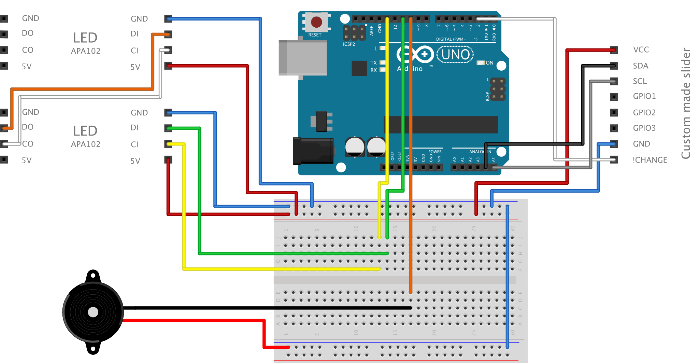

# TinySoundmachine
Software for a small hardware device to play music. Compatible with Arduino Uno and Teensy 3.5. Uses APA102 LEDs and custom made sliders.

## Hardware

#### Basic Version
* Arduino Uno
* LED stripes (APA102)
* Passive Buzzer
* Slider (Custom made circuit board for touch input, uses Atmel AT42QT2160)

#### Additional Parts
* Teensy 3.5

### Circuit

Image originally created with [Fritzing](http://fritzing.org) and further edited as svg.